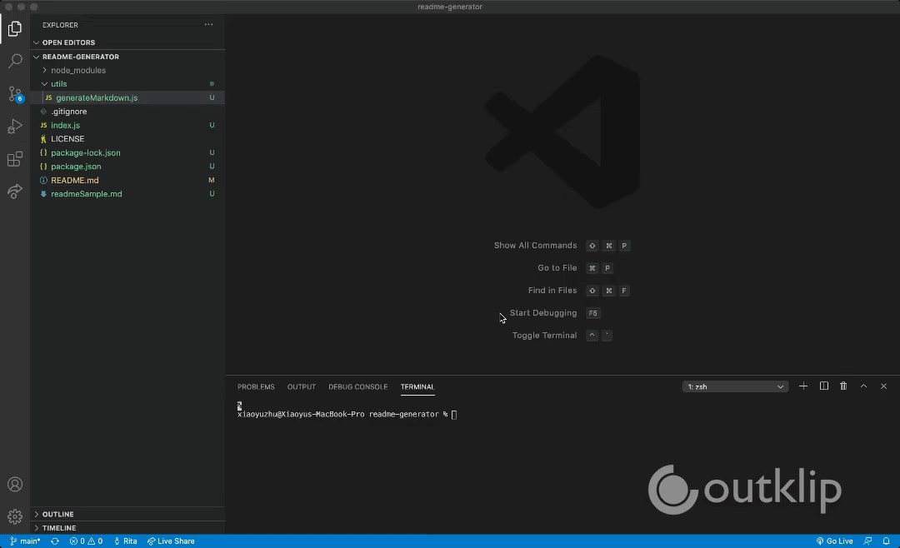

  # Readme Generator
  
  

  ## Description
  Every good project needs a quality README with information about the app. This is a command-line application that runs with Node.js that dynamically generates a README.md file based on input about your project. 

  ## Table of Contents
  * [Usage](#usage)
  * [Installation](#installation)
  * [Contributing](#contributing)
  * [Tests](#tests)
  * [Questions](#questions)
  * [License](#license)

  ## Usage
  
  
  When you run node index.js, the application uses the inquirer package to prompt you in the command line with a series of questions about your GitHub and about your project.(so, if you don't answer the optional questions, such as Installation, an Installation section will not be included in your README). The README will also include badges for your GitHub repo. Finally, fs.writeFile is used to generate your project's README.md file. 

  ## Installation
  To install necessary dependencies, run the following command:
 
      npm i

  ## Contributing
      Folk / pull

  ## Tests
  To run test, run the follwoing command:

      npm test

  ## Questions
  If you have any questions about the repo, open an issue or contact me directly @[xiaoyz28@uw.edu](xiaoyz28@uw.edu). You can find more of my work at [zhuxiaoyu1019](https://github.com/zhuxiaoyu1019).

  ## License 
  Copyright (c) Rita Z. All rights reserved.
  
  Licensed under the [MIT](https://choosealicense.com/licenses/mit/) license.
  
